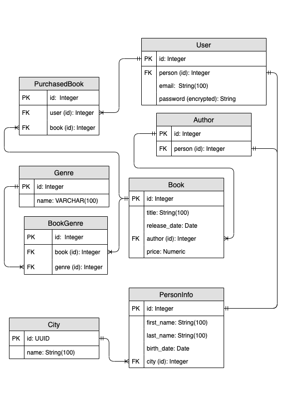

# Library API

Course work on the topic **"API for library book management"**

- FastAPI
- PostgreSQL
- JWT authentication
- Pgadmin (for development only)

# Database entities

**Preliminary ER diagram**

**Autogenerated UML-diagram**

